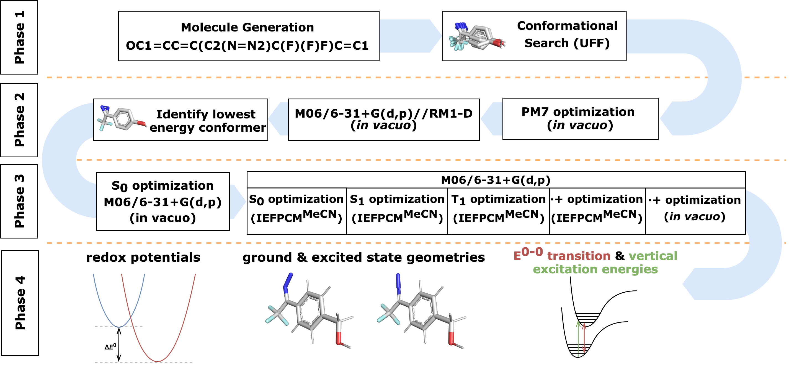

# Workflow for the VERDE Materials Database
The Virtual Excited State Reference for the Discovery of Electronic Materials Database (VERDE Materials DB) is a database of excited state geometries, energies, and properties of organic molecules with potential applications in sustainable materials including photovolatic cells and sunscreens. The calculations performed through this workflow allow one to probe the behavior and properties of photoexcited systems to streamline to the process of discovering novel, sustainable materials. The workflow for the calculations and data extraction follows four phases.

**Phase 1** involves the generation of a set of unique molecules and their initial conformers. Conformers receive an initial force field optimization using UFF.

**Phase 2** is where the lowest energy conformer is identified through semi-empirical optimizations and single-point DFT calculations.

**Phase 3** consists of the majority of the DFT optimizations and includes optimization and frequency calculations in various electronic states including S<sub>0</sub>, S<sub>1</sub>, T<sub>1</sub>, and radical cations.

**Phase 4** involves the extraction of data from the output files and calculation of various properties including geometries, ionization and redox potentials, and 0-0 transition energies.



#### Methodology
##### Combinatorial molecule generation
Once a core has been selected, it is substituted at various, user-specified positions with a set of 17 conjugated spacer groups. The new molecules then undergo substitution at pre-determined terminal positions with a set of 9 terminal groups. Below is an example.


##### Conformer generation
Conformer generation is performed by converting the combinatorially generated molecules from SMILES strings to a UFF-optimized set of four conformers. The conformers are then converted into PDB files which are used to generate input files for the PM7 optimization.

##### Semi-empirical optimizations
The generated conformers undergo optimization at two levels: a PM7 optimization (using Gaussian 16) followed by an RM1-D optimization (using GAMESS). Each RM1-D optimized conformer then undergoes a single-point DFT calculation at the `M06/6-31+G(d,p)` level to enable the more accurate comparison of the energies of the conformers.

##### Lowest energy conformer selection
For each molecule, the conformer with the lowest single-point energy at the end of the RM1-D optimization is selected as the starting point for the _in vacuo_ S<sub>0</sub> DFT optimization.

##### DFT calculations
Once the lowest energy conformer has been determined, its geometry is used as the starting point for _in vacuo_ S<sub>0</sub> DFT optimization. This DFT-optimized geometry is then used as the starting point for S<sub>0</sub>, S<sub>1</sub>, and T<sub>1</sub> DFT optimizations using an acetonitrile polarizable continuum model (IEFPCM<sup>MeCN</sup>). Additionally, the radical cation is optimized both _in vacuo_ and in IEFPCM<sup>MeCN</sup> to allow for the calculation of redox potentials. All DFT optimizations use the `M06/6-31+G(d,p)` method. Additionally, each DFT optimization is followed by a frequency calculation to compute thermal energies.

## Getting started
This workflow is designed to run on HPCs using the SLURM workload manager.

### Prerequisites
The cluster must provide access to [Gaussian 16](https://gaussian.com/gaussian16/) and [GAMESS] (https://www.msg.chem.iastate.edu/GAMESS/) version 2018-R1 or later. 
#### Molecule generation
Running the `mol_gen.py` script requires several python packages which may not be offered or easily installable on many HPCs. The `rdkit.yaml` file in the `misc` folder lists the required packages. The file can be used to install the required packages with Anaconda. If you haven't already, download [Anaconda](https://www.anaconda.com/distribution/) or later with Python 3.7. Once installed, open Anaconda Prompt, go to the directory containing the `rdkit.yaml` file and create a new conda environment.
```console
conda env create --file rdkit.yaml --name rdkit_env
```
Then activate the environment.
```console
conda activate rdkit_env
```
Once this is done, you are ready to execute the `mol_gen.py` script (see [generating molecules](#generating-molecules) below).

### Installing
To install the workflow, first, clone this GitHub repository into your home directory.
```console
git clone https://github.com/kuriba/flow.git
```
Then, go to the directory and run the init.sh script. This must only be done the first time you are installing the workflow.
```console
bash init.sh
```
The initialization script will modify your .bashrc file and assumes it to be located at `~/.bashrc` (if this isn't the case, modify the location, specified by the `bashrc_source` variable, in the `init.sh` script). In addition, the script assumes your scratch directory to be located at `/scratch/$USER` (modify the `scratch_dir` variable in `init.sh`, if this is not the case).

## Running the workflow
Execution of the workflow is accomplished in three steps: Creating a directory for the workflow, generating and uploading conformers as PDB files to the `unopt_pdbs` folder of the workflow, then submitting the workflow. 

### Generating molecules
Molecules can be generated according to the [combinatorial methodology](#combinatorial-molecule-generation) described above. The `mol_gen.py` script included in the `utils` folder can be used to accomplish this. Simply create a SMILES string for a molecule with uranium atoms at the positions where you would like to attach spacer groups.

<p align="center">
  
  <p align="center">[U]C1=C(C2=C3C4=CC=C2C=C1)C=CC3=C5C=CC6=C(C=CC7=CC=C4C5=C67)[U]</p>
</p>

Then run the `mol_gen.py` script from a directory where you'd like to store the generated structures. Run the script as follows (ensure that you have installed the preqrequisite packages and activated the correct environment, see [molecule generation](#molecule-generation) above):
```console
python mol_gen.py pyroperylenes_2sub [U]C1=C(C2=C3C4=CC=C2C=C1)C=CC3=C5C=CC6=C(C=CC7=CC=C4C5=C67)[U]
```
This will combinatorially generate molecules by performing substitutions on the given core. Each unique molecule will then be used to produce four conformers which are placed in a directory called `pyroperylenes_2sub` (the directory is automatically created if it doesn't already exist). The PDB files are named by the InChIKey of the molecule followed by an underscore and number indicating the conformer ID (starting from 0).

If you would like to use manually generated molecules, simply ensure that each conformer for each molecule is numbered starting from 0. For example:
```console
mol_0.pdb
mol_1.pdb
mol_2.pdb
other_mol_0.pdb
other_mol_1.pdb
other_mol_2.pdb
```

### Preparing submission
##### Setting up a workflow directory
To create a directory for your workflow, go to your scratch directory and run the `setup_flow.sh` script followed by the name of the workflow.
```console
bash setup_flow.sh my_first_workflow
```
This will create a workflow directory tree. Maintenance of the structure of the tree is crucial for the proper automation of the flow because it relies on relative positions of directories to automate certain tasks.

##### Submitting the workflow
Once the workflow directory has been made, place your conformer PDB files in the `unopt_pdbs` folder, then, from the head of the workflow tree, execute the `begin_calcs.sh` script which will use the PDB files to create input files for the PM7 optimization and submit a workflow.
```console
bash flow-tools/begin_calcs.sh
```

##### Monitoring progress
The `check_prog.py` script is provided for monitoring the progress of a workflow. To use it, simply go to the directory of a running or completed workflow and execute the script.
```console
python $FLOW/utils/check_prog.py
```
This will output a small report of the overall progress of the calculations.

## Acknowledgements

   Prof. Steven A. Lopez   
   Fatemah Mukadum   
   Jordan Cox   
   Patrick Neal   

---
#### External links
   [Lopez Lab website](https://web.northeastern.edu/lopezlab)   
   [VERDE Materials DB](https://doi.org/10.18126/8v3wxz72)   
